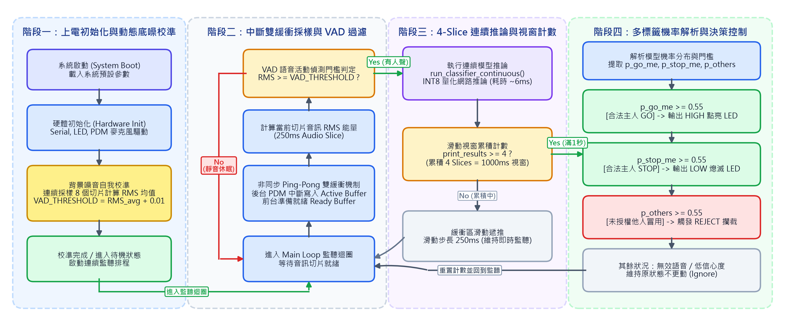
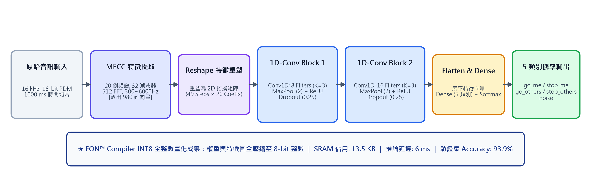
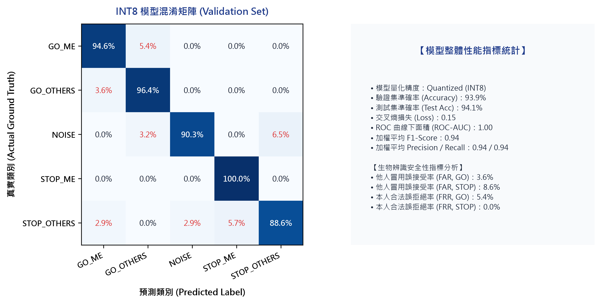

# TinyML On-Device Speaker Verification & Voice Control System
### 基於 TinyML 之語者辨識與邊緣量化部署實作系統

[](https://store.arduino.cc/products/arduino-nano-33-ble)
[-blue)](https://www.nordicsemi.com/products/nrf52840)
[](https://github.com/blackbigg/tinyml-speaker-recognition)
[-orange)](https://github.com/blackbigg/tinyml-speaker-recognition)
[](https://github.com/blackbigg/tinyml-speaker-recognition)
[](https://opensource.org/licenses/MIT)

> **開發者**：劉誠豐 (Cheng-Feng Liu)  
> **學校系所**：國立臺北科技大學 電子工程系 (National Taipei University of Technology)  
> **專案性質**：邊緣運算課程專題 (Edge Computing Course Project)

---

## 📌 專案簡介 (Project Overview)

本專案為《邊緣運算》課程實作專題，目標是在資源受限的微控制器（Arduino Nano 33 BLE，內建 Nordic nRF52840, Arm Cortex-M4F @ 64MHz，無 NPU，僅 256KB SRAM）上，實現**完全離線（100% On-Device）的語者特徵辨識與關鍵字語音控制系統**。

除了辨識語音指令語義（「GO」開燈、「STOP」關燈）之外，系統亦加入**發話者身分鑑別（Speaker Verification）**，能有效阻斷未授權他人的冒用觸發。全流程透過 Edge Impulse 進行資料收集、特徵工程、模型訓練與 INT8 量化，並在實體開發板完成聲學現場驗證。

### 核心實測亮點：
* **極低記憶體開銷**：神經網路張量佔用 **13.5 KB SRAM**（系統運行 Peak RAM: **31.3 KB** / Flash: **31.4 KB**），僅佔內部 SRAM 約 5.3%。
* **毫秒級即時推論**：單次神經網路推論耗時約 **6 ms**（含 MFCC 總處理時間約 24 ms），支援 250 ms 滑動視窗連續監聽。
* **生物辨識安全性**：測試集準確率達 **94.1%**（5 類別），他人冒用誤接受率（FAR）為 **3.6%**（GO）與 **8.6%**（STOP）。
* **動態靜音過濾**：韌體實作動態 RMS-VAD 底噪自我校準，環境靜音時直接跳過神經網路推論，大幅降低待機負載。

---

## 📊 硬體規格與實測數據 (Hardware Benchmarks)

| 評估維度 | 實測規格與數據 | 工程設計說明 |
| :--- | :--- | :--- |
| **主控核心** | Arm Cortex-M4F @ 64MHz ｜ 1MB Flash ｜ 256KB SRAM | 主流工業級低功耗 MCU，無硬體 NPU 加速單元 |
| **音訊採樣** | 16 kHz / 16-bit Mono PDM 數位麥克風 (MP34DT05) | 涵蓋人類語音 Nyquist 頻寬 (8 kHz)，硬體中斷採樣 |
| **緩衝架構** | 非同步 Ping-Pong 雙緩衝機制 (250 ms / 切片) | 消除採樣與推論之 CPU 競爭，確保音訊取樣零遺漏 |
| **待機優化** | 動態 RMS-VAD 底噪自我校準 (Power Gating) | 環境靜音時阻斷推論運算，降低持續監聽功耗 |
| **特徵萃取 (DSP)** | MFCC (20 倒頻譜係數, 512-FFT, 32 濾波器, 300~6000Hz) | 提取人聲共振峰 (F1 ~ F3)，特徵計算耗時約 18 ms |
| **模型架構** | 1D-CNN (2 Conv1D + MaxPool + Dropout) ｜ INT8 全量化 | EON Compiler 編譯，權重與激活值全壓至 8-bit 整數 |
| **記憶體佔用** | 神經網路 13.5 KB（系統 Peak RAM 31.3 KB / Flash 31.4 KB） | 佔 256KB SRAM 之 5.3%，保留充裕空間予後續邏輯 |
| **推論延遲** | 神經網路推論 6 ms ｜ 系統總延遲約 24 ms (DSP+NN) | 遠低於即時互動門檻 (<100 ms) |
| **辨識準確率** | 驗證集 93.9% ｜ 測試集 94.1% ｜ F1-Score 0.94 | 5 類別分離度良好（本人GO/STOP、他人GO/STOP、噪音） |
| **安全性指標** | 他人冒用誤接受率 (FAR): 3.6% (GO) / 8.6% (STOP)<br>本人合法誤拒絕率 (FRR): 5.4% (GO) / 0.0% (STOP) | 兼具授權易用性與冒用阻斷防護能力 |

---

## 🏗️ 系統架構與韌體執行管線 (System Pipeline)



1. **非同步 Ping-Pong 雙緩衝機制**：  
   PDM 中斷函式在後台持續填充 Active Buffer，前台 CPU 則對 Ready Buffer 執行推論，實現採樣與運算解耦。
2. **動態 RMS-VAD 底噪自我校準**：  
   在系統啟動時連續採樣 8 個切片計算環境背景底噪均方根（RMS），動態建立門檻（`VAD_THRESHOLD = RMS_avg + 0.01`）。主迴圈推論前先判定 RMS，靜音時直接休眠跳過推論。
3. **4-Slice 滑動視窗連續推論**：  
   語音辨識視窗為 1000 ms，切分為 4 個 250 ms 子切片。每 250 ms 推進一個切片並觸發判定，維持即時連續監聽。
4. **多標籤機率解析與決策控制**：  
   設定信心度門檻 `CONFIDENCE_THRESHOLD = 0.55`：
   * `p_go_me >= 0.55`：本人指令「GO」 ➔ 輸出 HIGH 點亮 LED。
   * `p_stop_me >= 0.55`：本人指令「STOP」 ➔ 輸出 LOW 熄滅 LED。
   * `p_others >= 0.55`：他人冒用 ➔ 觸發 REJECT 攔截並保持原狀態。
   * 其餘狀況：低信心度或背景雜訊 ➔ 維持原狀態不更動。

---

## 🧠 神經網路拓撲與 INT8 量化 (Neural Network & Quantization)



* **訊號前處理**：MFCC 聚焦 300~6000 Hz，配置 20 階倒頻譜係數、32 組梅爾濾波器、512 點 FFT。
* **1D-CNN 網路架構**：
  * 輸入重塑為 (49 x 20) 特徵矩陣。
  * 卷積層 1：Filters: 8, Kernel: 3, ReLU。
  * 卷積層 2：Filters: 16, Kernel: 3, ReLU。
  * 正則化：MaxPool + Dropout (rate = 0.25) 防止過擬合。
  * 輸出層：Dense Softmax 連接 5 類別輸出。
* **INT8 量化**：全網絡量化為 8-bit 整數，神經網路記憶體由原本 Float32 的 ~54 KB 大幅縮減至 13.5 KB，且準確率無顯著衰退。

---

## 📈 測試集混淆矩陣與性能表現 (Performance)



模型在未知測試集上表現穩定，5 類別對角線分佈顯著，平均 F1-Score 達 0.94，本人與他人之聲音特徵具備良好的分離度。

---

## 🎬 實體開發板現場測試 (Demo Showcase)

程式燒錄至實體 Arduino Nano 33 BLE 進行現場實測：

| 測試案例 | 發話者與輸入語音 | 系統決策與動作 | 實機測試狀態 | 影片連結 |
| :---: | :---: | :---: | :---: | :---: |
| **Demo 1** | 本人發音「GO」 | OWNER_GO 信心度達標 ➔ 輸出 High | **成功觸發 (LED 點亮)** | [me_test1.mp4](demo_videos/me_test1.mp4) |
| **Demo 2** | 本人發音「STOP」 | OWNER_STOP 信心度達標 ➔ 輸出 Low | **成功觸發 (LED 熄滅)** | [me_test2.mp4](demo_videos/me_test2.mp4) |
| **Demo 3** | 他人冒用發音「GO」 | 觸發 REJECT 邏輯阻斷 | **成功攔截 (LED 保持熄滅)** | [others_go.mp4](demo_videos/others_go.mp4) |
| **Demo 4** | 他人冒用發音「STOP」 | 觸發 REJECT 邏輯阻斷 | **成功攔截 (LED 保持點亮)** | [others_stop.mp4](demo_videos/others_stop.mp4) |

---

## 🔍 工程問題剖析與後續改善 (Engineering Insights)

1. **揚聲器二次重播失真現象（防重放特性）**：  
   實測以筆電喇叭播放預錄本人語音時，系統會判定為 `others`。分析為消費級喇叭之頻率響應失真改變了共振峰分佈，物理上形成了天然的防錄音重放保護。
2. **上電瞬態雜訊處理**：  
   硬體插拔時產生的電氣突波可能拉高初始 VAD 門檻。後續可在初始化階段導入中位數濾波（Median Filter）剔除離群雜訊。
3. **固定視窗長度之特徵稀釋**：  
   1000 ms 固定視窗中，若發音時間較短（如 0.3 秒），其餘靜音訊號會稀釋卷積特徵，後續可加入簡易端點偵測進行對齊。

---

## 🚀 快速開始與燒錄說明 (Quick Start)

### 硬體需求
* [Arduino Nano 33 BLE](https://store.arduino.cc/products/arduino-nano-33-ble)（含板載 MP34DT05 PDM 麥克風）
* Micro USB 傳輸線

### 軟體環境與步驟
1. **複製專案**：
   ```bash
   git clone https://github.com/blackbigg/tinyml-speaker-recognition.git
   cd tinyml-speaker-recognition
   ```
2. **匯入 Edge Impulse 模型庫**：
   * 開啟 Arduino IDE。
   * 點選 `草稿碼 (Sketch)` ➔ `載入程式庫 (Include Library)` ➔ `加入 .ZIP 程式庫... (Add .ZIP Library...)`。
   * 選擇本倉庫中的 `models/ei-edge_computing_project-arduino-1.0.1.zip`。
3. **開啟並燒錄程式**：
   * 開啟 `firmware/speaker_verification/speaker_verification.ino`。
   * 開發板選擇 **Arduino Nano 33 BLE**，並選取正確的 COM 埠。
   * 點擊 **上傳 (Upload)**。
4. **開啟序列埠監控視窗**：
   * 波特率設定為 **115200 baud**。
   * 開機靜候 2 秒完成底噪校準，即可開始說出「GO」或「STOP」進行控制。

---

## 📂 專案目錄結構 (Repository Structure)

```text
tinyml-speaker-recognition/
├── README.md                      # 專案說明文件
├── LICENSE                        # MIT License
├── .gitignore                     # Git 忽略設定
├── firmware/
│   └── speaker_verification/
│       └── speaker_verification.ino # Arduino 韌體原始碼（含雙緩衝與決策邏輯）
├── models/
│   └── ei-edge_computing_project-arduino-1.0.1.zip # Edge Impulse 匯出之 C++ 推論函式庫
├── docs/
│   └── figures/                   # 系統架構圖與流程圖
│       ├── fig1_system_flowchart_horizontal.png
│       ├── fig2_cnn_pipeline_horizontal.png
│       └── fig3_confusion_matrix_academic.png
└── demo_videos/                   # 實機測試錄影
    ├── me_test1.mp4               # 本人 GO (開燈)
    ├── me_test2.mp4               # 本人 STOP (關燈)
    ├── others_go.mp4              # 他人 GO (阻斷)
    └── others_stop.mp4            # 他人 STOP (阻斷)
```

---

## 📜 授權條款 (License)

本專案採用 [MIT License](LICENSE) 授權。
