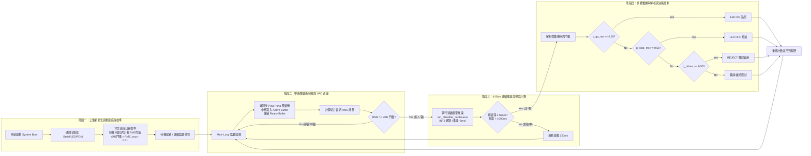

# 國立陽明交通大學 產學創新研究學院 智能系統研究所碩士班（代碼 840）
## 【有利審查文件：附錄 E】TinyML 語者辨識與邊緣硬體量化部署實作報告
> **對應備審模組**：考生學習資料表自選優秀科目《邊緣運算（92分）》實作佐證 ｜ 自傳第二章研發實績第 4 項佐證文件  
> **申請人**：劉誠豐（國立臺北科技大學 電子工程系） ｜ **專案性質**：專業課程核心實作（全流程 100% 獨立研發）  
> **驗證硬體**：Arduino Nano 33 BLE (Nordic nRF52840, Arm Cortex-M4F @ 64MHz, 256KB SRAM, 1MB Flash)

---

### 一、 專案核心成果摘要與實測性能規格 (Executive Highlights & Specifications)

傳統邊緣關鍵字語音控制（KWS）普遍缺乏「發話者身分鑑別（Speaker Verification）」且過度依賴雲端推論，存在隱私外洩與未授權冒用之資安風險。本專案鎖定資源極度受限的微控制器（Nordic nRF52840, Arm Cortex-M4F @ 64MHz，無硬體 NPU，僅 256KB SRAM），在 100% 離線本地端運算前提下，獨立實作「關鍵字與語者特徵聯合鑑別」之輕量化控制系統。驗證在神經網路張量僅佔 13.5 KB SRAM 的極限資源下，透過非同步雙緩衝、動態 VAD 底噪自我校準與 INT8 全量化，達成 6ms 即時推論、94.1% 測試集準確率與極低待機功耗。完整運算資源開銷與聲學性能評估規格如下表所示：

| 評估維度 (Dimension) | 實測數據與規格 (Metrics) | 工程意義與硬體限制考量 (Technical Notes) |
| :--- | :--- | :--- |
| **主控核心與儲存** | Arm Cortex-M4F @ 64MHz ｜ 1MB Flash ｜ 256KB SRAM | 主流工業級低功耗 MCU，無專屬硬體 NPU 加速單元 |
| **音訊取樣前端** | 16 kHz / 16-bit PDM 數位麥克風 (MP34DT05) | 涵蓋人類語音 Nyquist 頻寬 (8 kHz)，硬體中斷取樣 |
| **緩衝管線架構** | 非同步 Ping-Pong 雙緩衝機制 (250 ms / Slice) | 消除採樣與推論之 CPU 競爭，確保音訊取樣零遺漏 (Zero Drop) |
| **待機功耗優化** | 動態 RMS-VAD 底噪自我校準 (Power Gating) | 環境靜音時阻斷後續推論運算，大幅降低連續監聽待機負載 |
| **數位訊號處理 (DSP)** | MFCC (20 倒頻譜係數, 512-FFT, 32 濾波器, 300~6000Hz) | 聚焦人類聲道共振峰 (F1~F3)，單次特徵計算耗時約 18 ms |
| **模型架構與量化** | 1D-CNN (2 Conv Layers + MaxPool + Dropout) ｜ INT8 全整數量化 | EON Compiler 編譯，參數量與特徵圖壓縮至 8-bit 整數 |
| **記憶體開銷 (Memory)** | 神經網路張量佔用 **13.5 KB**（系統運行 Peak RAM **31.3 KB** / Flash **31.4 KB**） | 僅佔內部 256KB SRAM 之 5.2%，保留充裕空間予通訊與控制邏輯 |
| **推論響應延遲** | 單次神經網路推論 **6 ms** ｜ 系統總處理延遲約 **24 ms** (DSP+NN) | 低於即時互動閾值 (<100 ms)，支援 250 ms 滑動連續推論 |
| **模型整體表現** | 驗證集準確率 **93.9%** ｜ 測試集準確率 **94.1%** ｜ ROC-AUC **1.00** ｜ F1 **0.94** | 5 類別高分離度 (本人GO/STOP、他人GO/STOP、背景噪音) |
| **生物辨識安全性指標** | 他人冒用誤接受率 (FAR): **3.6% (GO) / 8.6% (STOP)** 本人合法誤拒絕率 (FRR): **5.4% (GO) / 0.0% (STOP)** | 量化驗證系統兼具授權易用性（高召回）與冒用拒絕防護能力 |

---

### 二、 端到端系統架構與韌體執行管線 (System Architecture & Firmware Pipeline)

為在無 RTOS 之裸機微控制器上達成零延遲、不漏音之連續監聽，本專案重構之橫向多階段系統執行流程圖如下所示：

*圖 1：系統韌體執行與決策控制橫向流程圖（含動態 VAD 校準、雙緩衝管線與決策邏輯）*

1. **非同步 Ping-Pong 雙緩衝機制**：  
   微控制器推論需耗損約 24ms 週期（含 DSP）。傳統阻塞式讀取將導致採樣中斷與音訊丟包。本系統建立 `inference_t` 雙緩衝結構，透過 PDM 中斷回呼函式（`pdm_data_ready_inference_callback`）在後台持續填充 Active Buffer，前台 CPU 對 Ready Buffer 執行推論，實現音訊採樣與模型計算之完全解耦並行。
2. **動態 RMS-VAD 底噪自我校準機制**：  
   在 `setup()` 階段採樣 8 個切片計算環境背景底噪均方根（RMS）能量，加上裕度（`VAD_MARGIN = 0.01`）動態設定門檻。主迴圈於推論前先評估切片 RMS，若低於門檻（環境靜音）則直接跳過 MFCC 與神經網路推論，大幅降低 MCU 空轉與電池待機耗電。
3. **4-Slice 滑動視窗連續推論**：  
   以 1000 ms 為模型視窗（涵蓋單詞發音完整度），切分為 4 個 250 ms 子切片。每 250 ms 推進一個切片並觸發推論決策，確保連續監聽下對語音指令之反應時間在 250 ms 以內。

---

### 三、 輕量化神經網路、INT8 量化與實機驗證 (CNN Topology, Quantization & On-Device Testing)

*圖 2：1D-CNN 輕量化卷積神經網路端到端架構拓撲圖*

**【特徵工程與模型架構配置】**  
* **MFCC 聲學設計**：聚焦 **300~6000 Hz**（覆蓋人類發聲基頻與共振峰 $F_1 \sim F_3$，排除高低頻環境雜訊）；配置 **20 階倒頻譜係數**、32 組梅爾濾波器、512 點 FFT，預加重係數 0.98 補償高頻能量。
* **1D-CNN 輕量化拓撲**：輸入重塑為 20 欄矩陣；兩層 1D 卷積層（Filters: 8, 16; Kernel: 3）搭配 MaxPool 與 Dropout (0.25) 防止過擬合；經 Flatten 連接 5 類別輸出。
* **INT8 全整數量化**：全網絡量化為 8-bit 整數，推論時間壓縮至 6 ms，神經網路張量記憶體僅 13.5 KB。
* **決策門檻**：設定 `CONFIDENCE_THRESHOLD = 0.55`。

*圖 3：INT8 量化模型混淆矩陣 (Confusion Matrix) 與各項性能指標統計*

#### 【實體開發板聲學驗證結果】（燒錄至 Arduino Nano 33 BLE 進行現場測試，全部通過驗證）
| 測試案例 (Video) | 輸入音訊與發話者 | 系統判定與控制動作 | 實機測試狀態 |
| :--- | :--- | :--- | :--- |
| **Demo 1 (me_test1.mp4)** | 本人發音「GO」 | OWNER_GO 信心度達標，輸出 High | **成功觸發 (LED 點亮)** |
| **Demo 2 (me_test2.mp4)** | 本人發音「STOP」 | OWNER_STOP 信心度達標，輸出 Low | **成功觸發 (LED 熄滅)** |
| **Demo 3 (others_go.mp4)** | 他人冒用發音「GO」 | 觸發 REJECT 邏輯，阻斷開關控制 | **成功攔截 (LED 保持熄滅)** |
| **Demo 4 (others_stop.mp4)** | 他人冒用發音「STOP」 | 觸發 REJECT 邏輯，阻斷開關控制 | **成功攔截 (LED 保持點亮)** |

---

### 四、 工程限制剖析與客觀技術改進策略 (Limitations & Technical Insights)

1. **揚聲器二次重播之頻譜失真現象分析（天然防重放特性）**：  
   實測以電腦揚聲器播放預錄之本人語音時，系統辨識靈敏度明顯下降並判定為 `others`。機理分析顯示：消費級喇叭與聲卡之非平坦頻率響應（Frequency Response）與震膜諧波失真改變了人聲共振峰分佈，使提取之 MFCC 偏離原生分佈。此物理聲學特性客觀上形成了天然的「防錄音重放攻擊（Anti-Replay Attack）」機制，提升了實體安全門禁防偽度。
2. **上電瞬態雜訊與動態自適應底噪追蹤（Adaptive Noise Tracking）**：  
   實驗發現若上電瞬態存在插拔突波雜訊（RMS 達 0.11），會使初始固定門檻偏高而失效。後續改進策略：在 setup 階段採用滑動中位數濾波器（Median Filter）剔除離群突波；於主迴圈導入洩漏積分器（Leaky Integrator）以微小學習率自適應追蹤環境底噪漂移（如空調運轉），維持門檻之穩健性。
3. **固定長度視窗之短促發音特徵稀釋問題**：  
   模型視窗固定為 1000 ms，短促發音（如 0.3 秒）在特徵矩陣中佔比較低，其餘時間之無效訊號會稀釋卷積激活值。未來可導入輕量化音訊端點偵測（Endpointing / Trimming）以對齊有效訊號，或在 CNN 架構中加入全域時間平均池化（Global Temporal Average Pooling）以降低時長依賴。

---

### 五、 專案線上驗證資源 (Project Verification Links)
* **專案 GitHub 倉庫**（含 Arduino 雙緩衝韌體原始碼、EON 編譯函式庫與設定檔）：已開源收錄於個人專案集。
* **實機聲學驗證展示影片**（包含本人控制與他人阻斷測試影片 `me_test1~2`, `others_go/stop`）：已發布於雲端儲存空間。  
*(註：依審查規格精簡要求，原始碼全文不再於書面報告贅列，可直接透過線上儲存庫進行代碼檢核)*
